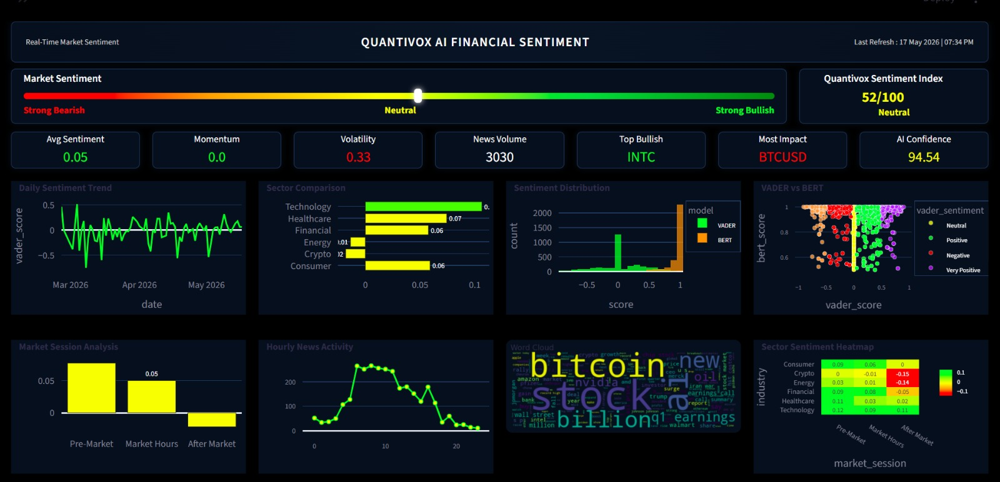

# QUANTIVOX — AI Financial Sentiment Analysis Platform

## Overview

Quantivox is an AI-powered financial sentiment analysis platform built using Streamlit, NLP, VADER, and BERT models to analyze real-time financial news sentiment, sector trends, market momentum, and investor behavior.

The platform provides interactive dashboards and advanced sentiment analytics for understanding financial market psychology and market movement patterns.

---

# Features

## Real-Time Financial Sentiment Analysis

* AI-powered sentiment scoring
* VADER and BERT sentiment comparison
* Dynamic market mood tracking

## Interactive Dashboard

* Professional dark-themed financial dashboard
* 8 analytical visualizations
* Dynamic KPI cards

## Market Intelligence

* Quantivox Sentiment Index (QSI)
* Market session analysis
* Sector sentiment heatmaps
* Momentum and volatility tracking

## NLP & AI Features

* Word cloud generation
* Sentiment distribution analysis
* AI confidence scoring
* Financial news processing

---

# Dashboard Components

## KPI Section

* Avg Sentiment
* Momentum
* Volatility
* News Volume
* Top Bullish Stock
* Most Impactful Ticker
* AI Confidence Score

## Charts & Visualizations

1. Daily Sentiment Trend
2. Sector Comparison
3. Sentiment Distribution
4. VADER vs BERT Analysis
5. Market Session Analysis
6. Hourly News Activity
7. Word Cloud
8. Sector Sentiment Heatmap

---

# Technologies Used

## Programming

* Python

## Dashboard & Visualization

* Streamlit
* Plotly
* Matplotlib

## Data Processing

* Pandas
* NumPy

## NLP & AI

* NLTK
* VADER Sentiment
* BERT
* Transformers

## Additional Libraries

* WordCloud
* OpenPyXL
* Scikit-learn

---

# Project Workflow

1. Financial news data collection
2. Data preprocessing and cleaning
3. NLP sentiment extraction
4. VADER & BERT sentiment scoring
5. Feature engineering
6. Dashboard visualization
7. AI-driven market analysis

---

# Installation

## Clone Repository

```bash
git clone https://github.com/girish3091990-max/Quantivox.git
```

## Install Dependencies

```bash
pip install -r requirements.txt
```

## Run Streamlit App

```bash
streamlit run Quantivox.py
```

---

# Sample Dashboard



---

# Business Value

Quantivox helps in:

* Real-time market sentiment monitoring
* Investor behavior analysis
* Financial news intelligence
* Risk monitoring
* Market trend analysis
* AI-assisted decision support

---

# Future Enhancements

* Live financial news API integration
* Predictive sentiment forecasting
* Portfolio risk analytics
* AI chatbot integration
* Real-time market alerts
* Cloud deployment

---

# Author

Girish Kumar
PGDM — Business Analytics
Business Analyst | Data Analyst | Power BI | NLP | Financial Analytics

---

# License

This project is licensed under the MIT License.
